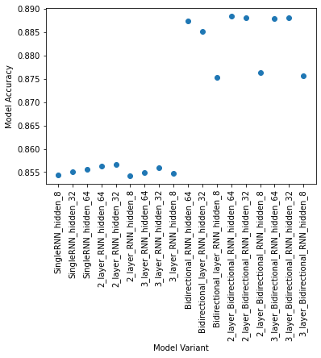

# Experiment with multiple models of RNN for Named Entity Recognition task

## Approaches used - 
* A single-layer RNN network.
* A k-layer RNN network, where k=[2,3]. 
* A bidirectional single-layer RNN. 
* A bidirectional k-layer RNN, where k=[2,3].

With hidden layers in the range - [8, 32, 64]
 
## Experiment Result
